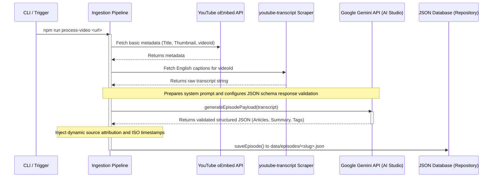
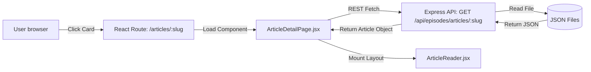

# YouTube Video to Premium Article Workflow

This document outlines the pipeline architecture behind extracting YouTube video transcripts, executing Gemini AI editorial generation, and dynamically serving custom magazine-grade articles to the user interface.

---

## 1. High-Level Ingestion Pipeline

The workflow starts with a YouTube video URL and ends with a validated, fully structured JSON dataset containing the episode overview and long-form articles.

### Ingestion Stages & Related Files:

1. **CLI / Entry Scripts**:
   * **Processing Script**: [processEpisode.js](file:///d:/ZeroPointFive/backend/scripts/processEpisode.js) - Invoked via `npm run process-video "<youtube-url>"`.
   * **Regenerating Script**: [regenerateEpisode.js](file:///d:/ZeroPointFive/backend/scripts/regenerateEpisode.js) - Re-runs the Gemini AI extraction using the cached transcript in case of API limits or schema updates, avoiding YouTube scrapers.
2. **Ingestion Director**:
   * [ingest.js](file:///d:/ZeroPointFive/backend/src/pipeline/ingest.js) - Manages the sequence of calls (fetch metadata, fetch transcript, execute Gemini call, write database).
3. **YouTube Metadata Extractor**:
   * [youtube.service.js](file:///d:/ZeroPointFive/backend/src/services/youtube.service.js) - Calls YouTube's public oEmbed endpoint (`https://www.youtube.com/oembed?url=...`) to gather video information.
4. **Transcript Strategy Provider**:
   * [transcript/index.js](file:///d:/ZeroPointFive/backend/src/services/transcript/index.js) & [youtube.provider.js](file:///d:/ZeroPointFive/backend/src/services/transcript/youtube.provider.js) - Implements transcript scraping via node modules.
5. **AI Content Generator**:
   * **Model Config**: [gemini.js](file:///d:/ZeroPointFive/backend/src/services/ai/gemini.js) - Houses the model configuration and SDK connection, defining a strict nested schema parameter (`responseSchema`) that forces Gemini to return a structured JSON output.
   * **AI Prompt**: [episode.prompt.js](file:///d:/ZeroPointFive/backend/src/services/ai/prompts/episode.prompt.js) - Details the instructions, quality controls, formatting layouts, and target length requirements (1500+ words).

---

## 2. Dynamic Frontend Rendering

The rendering on the frontend is completely dynamic and does not require static site rebuilds.

### Components & Related Files:

1. **Routing Mapping**:
   * [router.jsx](file:///d:/ZeroPointFive/frontend/src/app/router.jsx) - Registers dynamic parameterized paths for `/podcasts/:slug` (Episode View) and `/articles/:slug` (Fullscreen Magazine View).
2. **Overview / Detail Pages**:
   * [EpisodeDetailPage.jsx](file:///d:/ZeroPointFive/frontend/src/pages/EpisodeDetailPage.jsx) - Displays summary, takeaways list, and renders custom article teaser cards.
   * [ArticleDetailPage.jsx](file:///d:/ZeroPointFive/frontend/src/pages/ArticleDetailPage.jsx) - Feeds the matching dynamic URL slug to retrieve full article data from the backend, handling loading/error interfaces.
3. **Visual UI Presentation**:
   * [ArticleCard.jsx](file:///d:/ZeroPointFive/frontend/src/features/episode/components/ArticleCard.jsx) - Teaser card showing Title, Subtitle, tags, reading level/time, and Featured Insight.
   * [ArticleReader.jsx](file:///d:/ZeroPointFive/frontend/src/features/article/components/ArticleReader.jsx) & [ArticleReader.css](file:///d:/ZeroPointFive/frontend/src/features/article/components/ArticleReader.css) - Standalone reader layout implementing:
     * **Responsive Layouts**: Fixed sticky side-bar Table of Contents on desktop vs. collapsible accordion Table of Contents on mobile.
     * **Content Blocks**: Iterative parser rendering normal text paragraphs (`text`), highlighted sidebars (`insight`), and quote pullouts (`quote`).
     * **Anchor Highlighting**: A scroll-spy event listener that matches headers as the reader scrolls to highlight the active Table of Contents item.

---

## 3. Libraries & APIs Used

### Backend Module
* **`@google/generative-ai`** (npm SDK): The official library to connect to the Gemini API and enforce structured schema validations.
* **`youtube-transcript`** (npm library): Captures automated/custom English captions directly from YouTube video IDs.
* **`express`** (npm library): Node framework routing API requests.
* **`cors`** (npm library): Authorizes cross-origin network communication between the frontend server (`http://localhost:5173`) and backend server (`http://localhost:5000`).
* **`dotenv`** (npm library): Extracts secret API keys and environment variables.
* **`nodemon`** (npm library): Watches for directory additions and automatically restarts the local server.

### Frontend Module
* **`react` & `react-dom`** (React 19 framework): UI engine.
* **`react-router-dom`** (npm library): Manages frontend pagination and state-preserving routing.
* **`lucide-react`** (npm library): Crisp vector UI icons.
* **`motion`** (Framer Motion v12): Micro-animations and page entrance spring transitions.

### External APIs
* **YouTube oEmbed API** (`https://www.youtube.com/oembed`): An anonymous query API to gather video details.
* **Google Gemini API** (`gemini-2.5-flash`): The AI model executing editorial content processing and returning validated JSON objects.

---

## 4. Automation Strategy & Future Scope

### Dynamism:
The entire pipeline is **fully dynamic**. The backend repository uses a file-based JSON abstraction ([episode.repository.js](file:///d:/ZeroPointFive/backend/src/repositories/episode.repository.js)). When you process a new video:
1. Running the CLI command immediately writes a new `<slug>.json` file.
2. The backend Express server instantly exposes this record.
3. The frontend fetches the record by URL slug dynamically, rendering the new article with no manual updates or rebuilds.

### Future Scope:
1. **Webhook Auto-Ingestion**: Set up a PubSub webhook linked to the host's YouTube channel. When a new episode is uploaded, the YouTube hook calls the backend endpoint, automatically running the ingestion script and publishing the magazine article within minutes.
2. **Database Migration**: Swapping the JSON repository class with a MongoDB or PostgreSQL client for indexing as article counts grow.
3. **Advanced Speech-to-Text Providers**: Swapping the default캡션 scraper strategy in [transcript/index.js](file:///d:/ZeroPointFive/backend/src/services/transcript/index.js) with deep learning APIs (e.g. OpenAI Whisper or AssemblyAI) to provide diarization (speaker separation labels) for rich conversational layouts.
